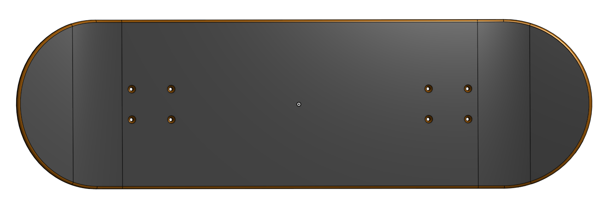
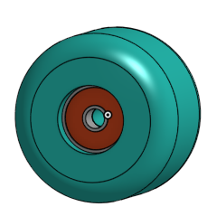
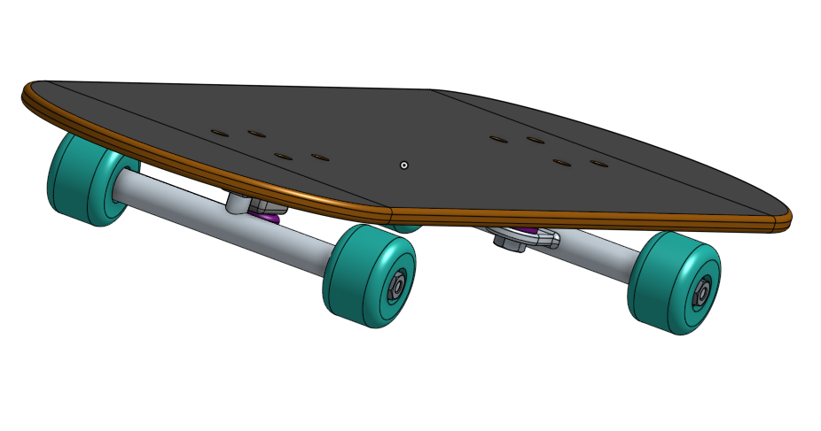

# AdvancedCAD

## Skateboard :)

### Description
Made a real nice to scale model of a skateboard in Onshape. It helped in practicing some onshape skills which I may have already known but needed a bit of a refresher in. The main goal was to make it look good and to make sure all the measurements were correct and it went alright overall (like no errors or anything like that, I don't know.)

### Link
[Skateboard :)](https://cvilleschools.onshape.com/documents/7101b0ae21cf2c3408e82262/w/627eb570c47ef1134c3f0e7a/e/ea5916481316ccc3d8594f33?renderMode=0&uiState=61701fa1b5044d58e2fe7d55)

### The Deck

#### Reflection
The deck went incredibly smoothly I had no problems with it nor could I really anticipate any obvious problems. 
A few tips though:
* Use keyboard shortcuts
  * Shift + S to create a sketch
  * N to view normal to the sketch
* Make sure your sketch is fully defined (there are no blue lines, and you can't move any lines or shapes)
* Pay attention to some of the features you use, such as the hole tool which creates really useful little holes which are perfectly sized for screws.

### The Trucks 

#### Reflection
The trucks WOULD have gone smoothly but there was some random problem with the holes not being there, I literally do not know how I fixed it, however the advice I can give is to make sure the holes are there BEFORE moving on because otherwise you have to roll it back and stuff and it's just a big pain.
More tips:
* Once again pay attention to the tools you're using, like the offset and use tool, as they can often be useful in the future.
* More keyboard shortcuts:
  * U for use 
  * L for line tool
* In particular the use tool helps to reflect **design intent** of your part, as it uses edges or parts from other features to add geometry in another sketch, also it just makes life easier!

### The Wheel and Bearing

#### Reflection
The wheels and bearings went really smoothly as well, the measurements for the bearings are bit strange though, like how it dimensions from the edge instead of dimensions as a radius. So just make sure you get those right.
Tips:
* Using the revolve tool is another good example of **design intent** as well as just making your own life easier, wheels are round so we make a revolve, which is a lot easier than an extrude
* MORE keyboard shortcuts:
  * P to hide planes
  * Q to use construction tool

### Assembly

#### Reflection

Assemblies are always easy peasy especially since onshape makes it so easy. The one problem is mating screws is really finicky however that's mostly just a time thing and less of an actual problem to figure out.
Tips:
* What makes putting in screws easier is the replicate tool, which replicates a part across a common edge, plane, feature etc. so just make sure to keep that in mind if you're ever having to put in a lot of the same thing.
* Keep in mind which mate connectors you're using when mating, where they are, etc. try to keep them consistent if you're mating the same type of part in a similar spot.
* Press K to hide mate connectors which saves your eyes from looking at that mess of mate connectors all day
