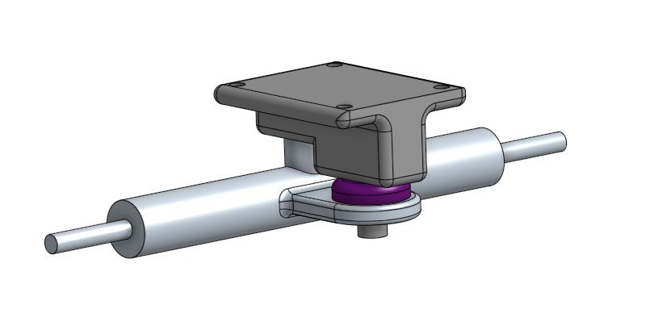

# AdvancedCAD

## Skateboard :)

My description of the Skateboard :)

### Link
[Skateboard :)](https://cvilleschools.onshape.com/documents/7101b0ae21cf2c3408e82262/w/627eb570c47ef1134c3f0e7a/e/ea5916481316ccc3d8594f33?renderMode=0&uiState=61701fa1b5044d58e2fe7d55)

### The Deck
Image AND relfectrion in each 

### The Trucks 

### The Wheel and Bearing

### Assembly

